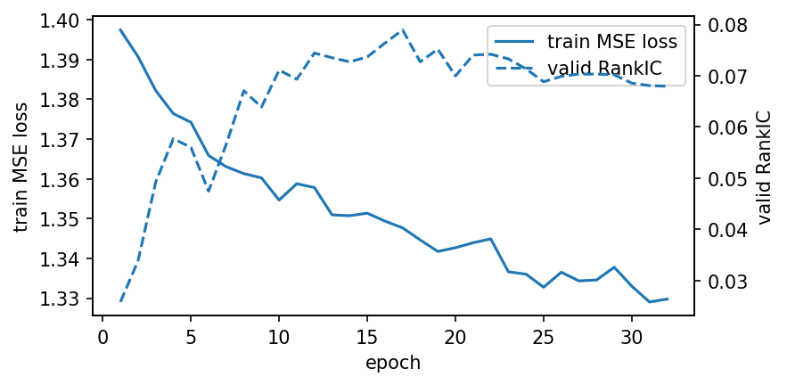

# RST-MoE on Alpha158 / CSI300

## 1. Experimental Setup

- **Data**:
  - Handler: Alpha158
  - Instruments: csi300
  - Train: 2008-01-01 ~ 2020-03-31
  - Valid: 2020-07-01 ~ 2022-12-31
  - Test: 2020-07-01 ~ 2022-12-31
- **Label**: ['Ref($close, -5) / Ref($close, -1) - 1']
  - **Model**:
    - class: QlibQuantMoE
    - d_model=64, n_layers=2, n_heads=4
    - main_loss=mse
    - value_embedding_type=feature_tokenizer
    - feature_tokenizer_add_factor_id=False
    - feature_tokenizer_bias=True
    - feature_tokenizer_init_std=0.02
    - use_feature_selection=False
    - use_alibi=False
- **Training**:
  - lr=5e-05, epochs=40, batch_size=300
  - seed=42
- **Backtest**:
  - strategy: TopkDropoutStrategy, topk=30, n_drop=5
  - benchmark=SH000300, deal_price=close, cost(open/close)=None/None

### 1.1 Full Config (Resolved)

```python
data_conf = {'class': 'TSDatasetH',
 'module_path': 'qlib.data.dataset',
 'kwargs': {'step_len': 8,
            'handler': {'class': 'Alpha158',
                        'module_path': 'qlib.contrib.data.handler',
                        'kwargs': {'start_time': '2008-01-01',
                                   'end_time': '2022-12-31',
                                   'fit_start_time': '2008-01-01',
                                   'fit_end_time': '2020-03-31',
                                   'instruments': 'csi300',
                                   'infer_processors': [{'class': 'RobustZScoreNorm',
                                                         'kwargs': {'fields_group': 'feature',
                                                                    'clip_outlier': True,
                                                                    'fit_start_time': '2008-01-01',
                                                                    'fit_end_time': '2020-03-31'}},
                                                        {'class': 'Fillna', 'kwargs': {'fields_group': 'feature'}}],
                                   'learn_processors': [{'class': 'DropnaLabel'},
                                                        {'class': 'CSZScoreNorm',
                                                         'kwargs': {'fields_group': 'label', 'method': 'robust'}}],
                                   'label': ['Ref($close, -5) / Ref($close, -1) - 1']}},
            'segments': {'train': ('2008-01-01', '2020-03-31'),
                         'valid': ('2020-07-01', '2022-12-31'),
                         'test': ('2020-07-01', '2022-12-31')}}}

model_config = {'d_model': 64,
 'n_heads': 4,
 'n_layers': 2,
 'd_ff': 128,
 'dropout': 0.1,
 'initializer_range': 0.02,
 'num_alphas': 158,
 'context_len': 8,
 'value_embedding_type': 'feature_tokenizer',
 'feature_tokenizer_bias': True,
 'feature_tokenizer_add_factor_id': False,
 'feature_tokenizer_init_std': 0.02,
 'use_regime_time_embedding': True,
 'time_tau_min': 0.5,
 'time_tau_max': 50.0,
 'time_tau_init': 5.0,
 'time_emb_init_std': 0.02,
 'time_decay_normalize': True,
 'use_regime_factor_gate': True,
 'factor_gate_scale': 1.0,
 'factor_gate_shift_scale': 0.2,
 'router_noise': 0.01,
 'router_temperature': 1.0,
 'router_z_loss_coef': 0.01,
 'router_use_layer_summary': True,
 'use_alibi': False,
 'use_feature_selection': False,
 'selection_reg_lambda': 1e-05,
 'selection_temperature': 0.1,
 'selection_noise_std': 0.5,
 'main_loss': 'mse',
 'loss_weights': {'listmle': 1.0, 'mse': 1.0, 'ic': 1.0, 'rank': 0.0, 'huber': 0.0},
 'mse_normalize': False,
 'rank_topk': 5,
 'huber_delta': 1.0,
 'listmle_tau': 0.8,
 'use_external_macro': True,
 'd_macro_input': 102,
 'regime_macro_dropout': 0.1,
 'regime_internal_mode': 'long',
 'regime_internal_lag': 5,
 'regime_internal_use_batch_stats': False,
 'regime_internal_tail_threshold': 2.0,
 'pooling_alpha': 0.7}

trainer_config = {'lr': 5e-05,
 'n_epochs': 40,
 'batch_size': 300,
 'precision': 'amp_fp16',
 'grad_accum_steps': 1,
 'seed': 42,
 'train_stop_key': 'loss_main',
 'train_stop_threshold': 1.33,
 'min_epochs': 5,
 'consecutive_k': 2,
 'num_workers': 0,
 'market_state_path': 'data/market_state_csi300.pkl',
 'market_state_shift': 0,
 'market_state_strict': True,
 'use_warmup': True,
 'warmup_ratio': 0.05,
 'warmup_steps': 0,
 'debug_sanity_check': True,
 'strict_valid_data_key': True}

port_conf = {'strategy': {'class': 'TopkDropoutStrategy',
              'module_path': 'qlib.contrib.strategy.signal_strategy',
              'kwargs': {'signal': '<PRED>', 'topk': 30, 'n_drop': 5}},
 'backtest': {'start_time': '2020-07-01',
              'end_time': '2022-12-30',
              'account': 100000000,
              'benchmark': 'SH000300',
              'exchange_kwargs': {'freq': 'day', 'deal_price': 'close'}}}
```

## 2. Cross-sectional Forecasting Performance

- **IC (test)**:
  - mean = 0.0618, std = 0.1469, ICIR = 0.42, HAC t-stat = 6.9 (lags=5)
- **RankIC (test)**:
  - mean = 0.0681, std = 0.1450, IR = 0.47, HAC t-stat = 7.8 (lags=5)
- 注：采用 Newey–West(HAC) t-stat 以处理日度序列的自相关/异方差。

### 2.X Regime Bucket Evaluation (test segment)

基于 `market_state`（与训练时相同的宏观状态文件）对 test 交易日做分桶，观察不同市场状态下的预测质量与路由行为差异。

- market_state: `market_state_csi300.pkl`, shift=0, fit_segments=['train'] (fit_days=2979, test_days=611)

- 2×2 分桶（median@fit）：`market_state_corr_pc1_ratio`=0.004828, `market_state_tail_2sigma`=-2.783e-05

| Regime               |   Days |   RankIC_mean |   RankIC_IR |   IC_mean |    IC_IR |   time_ratio_mean |   time_ratio_p10 |   time_ratio_p50 |   time_ratio_p90 |   gate_entropy_mean |   gate_entropy_p10 |   gate_entropy_p50 |   gate_entropy_p90 |   time_tau_mean |   time_tau_p10 |   time_tau_p50 |   time_tau_p90 |   time_half_life_mean |   time_half_life_p10 |   time_half_life_p50 |   time_half_life_p90 |   factor_gate_mean_mean |   factor_gate_mean_p10 |   factor_gate_mean_p50 |   factor_gate_mean_p90 |   factor_gate_std_mean |   factor_gate_std_p10 |   factor_gate_std_p50 |   factor_gate_std_p90 |   factor_gate_entropy_mean |   factor_gate_entropy_p10 |   factor_gate_entropy_p50 |   factor_gate_entropy_p90 |   factor_gate_topk_mass_5_mean |   factor_gate_topk_mass_5_p10 |   factor_gate_topk_mass_5_p50 |   factor_gate_topk_mass_5_p90 |   factor_gate_topk_mass_10_mean |   factor_gate_topk_mass_10_p10 |   factor_gate_topk_mass_10_p50 |   factor_gate_topk_mass_10_p90 |
|:---------------------|-------:|--------------:|------------:|----------:|---------:|------------------:|-----------------:|-----------------:|-----------------:|--------------------:|-------------------:|-------------------:|-------------------:|----------------:|---------------:|---------------:|---------------:|----------------------:|---------------------:|---------------------:|---------------------:|------------------------:|-----------------------:|-----------------------:|-----------------------:|-----------------------:|----------------------:|----------------------:|----------------------:|---------------------------:|--------------------------:|--------------------------:|--------------------------:|-------------------------------:|------------------------------:|------------------------------:|------------------------------:|--------------------------------:|-------------------------------:|-------------------------------:|-------------------------------:|
| High-PC1 / High-Tail |     56 |     0.110781  |    0.770561 | 0.100958  | 0.695899 |          0.612142 |         0.538798 |         0.652305 |         0.694677 |            0.634635 |           0.608245 |           0.638932 |           0.673821 |         4.93568 |        4.91838 |        4.93382 |        4.95505 |               3.42115 |              3.40916 |              3.41986 |              3.43458 |                 1.00025 |               0.995191 |               0.999283 |                1.00571 |              0.0287592 |             0.0195044 |             0.0287669 |             0.0394125 |                   0.944055 |                  0.93856  |                  0.942289 |                  0.953169 |                      0.0983715 |                     0.0854365 |                     0.0998792 |                      0.105551 |                        0.177872 |                       0.160124 |                       0.180554 |                       0.189919 |
| High-PC1 / Low-Tail  |    356 |     0.0629133 |    0.424869 | 0.0602581 | 0.400794 |          0.662508 |         0.606194 |         0.677872 |         0.706275 |            0.629605 |           0.602511 |           0.626803 |           0.664699 |         4.9287  |        4.91066 |        4.9261  |        4.94926 |               3.41631 |              3.40381 |              3.41451 |              3.43056 |                 1.0014  |               0.99552  |               1.00138  |                1.00739 |              0.0278294 |             0.0200333 |             0.0276081 |             0.036398  |                   0.943266 |                  0.93746  |                  0.942285 |                  0.950505 |                      0.099168  |                     0.0881049 |                     0.0998395 |                      0.10848  |                        0.17931  |                       0.163064 |                       0.179871 |                       0.19329  |
| Low-PC1 / High-Tail  |     46 |     0.0955667 |    0.671217 | 0.0918466 | 0.626085 |          0.650603 |         0.595286 |         0.686074 |         0.715399 |            0.618875 |           0.589872 |           0.617608 |           0.654182 |         4.93046 |        4.91066 |        4.9261  |        4.95312 |               3.41753 |              3.40381 |              3.41451 |              3.43324 |                 1.00288 |               0.998012 |               1.00233  |                1.00849 |              0.0272577 |             0.0193312 |             0.0257355 |             0.0395709 |                   0.944434 |                  0.936243 |                  0.94329  |                  0.952995 |                      0.0975647 |                     0.0854609 |                     0.0989745 |                      0.106431 |                        0.17762  |                       0.159859 |                       0.17928  |                       0.192468 |
| Low-PC1 / Low-Tail   |    153 |     0.0561953 |    0.411716 | 0.0420587 | 0.308268 |          0.68875  |         0.66126  |         0.691485 |         0.716079 |            0.615668 |           0.593735 |           0.615367 |           0.639687 |         4.92706 |        4.91066 |        4.92224 |        4.94926 |               3.41517 |              3.40381 |              3.41183 |              3.43056 |                 1.00372 |               0.997736 |               1.00412  |                1.00936 |              0.027469  |             0.020013  |             0.0272457 |             0.0351642 |                   0.946862 |                  0.940355 |                  0.947569 |                  0.952359 |                      0.0954436 |                     0.0850418 |                     0.0954176 |                      0.105315 |                        0.173799 |                       0.159776 |                       0.173193 |                       0.189166 |

- Terciles by `market_state_corr_pc1_ratio` (Market-mode strength (PC1 ratio)), edges@fit=[-0.4096, 0.4701]

| Bucket   |   Days |   RankIC_mean |   RankIC_IR |   IC_mean |    IC_IR |   time_ratio_mean |   time_ratio_p10 |   time_ratio_p50 |   time_ratio_p90 |   gate_entropy_mean |   gate_entropy_p10 |   gate_entropy_p50 |   gate_entropy_p90 |   time_tau_mean |   time_tau_p10 |   time_tau_p50 |   time_tau_p90 |   time_half_life_mean |   time_half_life_p10 |   time_half_life_p50 |   time_half_life_p90 |   factor_gate_mean_mean |   factor_gate_mean_p10 |   factor_gate_mean_p50 |   factor_gate_mean_p90 |   factor_gate_std_mean |   factor_gate_std_p10 |   factor_gate_std_p50 |   factor_gate_std_p90 |   factor_gate_entropy_mean |   factor_gate_entropy_p10 |   factor_gate_entropy_p50 |   factor_gate_entropy_p90 |   factor_gate_topk_mass_5_mean |   factor_gate_topk_mass_5_p10 |   factor_gate_topk_mass_5_p50 |   factor_gate_topk_mass_5_p90 |   factor_gate_topk_mass_10_mean |   factor_gate_topk_mass_10_p10 |   factor_gate_topk_mass_10_p50 |   factor_gate_topk_mass_10_p90 |
|:---------|-------:|--------------:|------------:|----------:|---------:|------------------:|-----------------:|-----------------:|-----------------:|--------------------:|-------------------:|-------------------:|-------------------:|----------------:|---------------:|---------------:|---------------:|----------------------:|---------------------:|---------------------:|---------------------:|------------------------:|-----------------------:|-----------------------:|-----------------------:|-----------------------:|----------------------:|----------------------:|----------------------:|---------------------------:|--------------------------:|--------------------------:|--------------------------:|-------------------------------:|------------------------------:|------------------------------:|------------------------------:|--------------------------------:|-------------------------------:|-------------------------------:|-------------------------------:|
| Low      |    113 |     0.06222   |    0.449231 | 0.0497022 | 0.360301 |          0.682436 |         0.655727 |         0.693346 |         0.719322 |            0.613084 |           0.588848 |           0.612964 |           0.639694 |         4.92623 |        4.91066 |        4.92224 |        4.9454  |               3.4146  |              3.40381 |              3.41183 |              3.42789 |                 1.00349 |               0.99777  |                1.00374 |                1.00885 |              0.026579  |             0.0199138 |             0.0264501 |             0.0347005 |                   0.947324 |                  0.941336 |                  0.947797 |                  0.952769 |                      0.094303  |                     0.084613  |                     0.0941182 |                      0.102991 |                        0.172216 |                       0.15683  |                       0.172791 |                       0.186272 |
| Mid      |    194 |     0.0713451 |    0.481545 | 0.0585788 | 0.396973 |          0.673376 |         0.642602 |         0.683838 |         0.705032 |            0.624284 |           0.603421 |           0.621987 |           0.649344 |         4.93004 |        4.91066 |        4.92996 |        4.95312 |               3.41724 |              3.40381 |              3.41718 |              3.43324 |                 1.00282 |               0.996858 |                1.00303 |                1.00905 |              0.0287239 |             0.0206157 |             0.0288665 |             0.0372744 |                   0.944287 |                  0.937456 |                  0.943484 |                  0.951771 |                      0.0983503 |                     0.0870231 |                     0.0988704 |                      0.107062 |                        0.178322 |                       0.161801 |                       0.178903 |                       0.192328 |
| High     |    304 |     0.0681677 |    0.46752  | 0.068371  | 0.456317 |          0.650293 |         0.587087 |         0.670876 |         0.7052   |            0.63143  |           0.60205  |           0.629819 |           0.670592 |         4.92949 |        4.91066 |        4.92996 |        4.94926 |               3.41686 |              3.40381 |              3.41718 |              3.43056 |                 1.0009  |               0.995197 |                1.00088 |                1.0069  |              0.0276268 |             0.0197004 |             0.0272403 |             0.0364636 |                   0.943238 |                  0.937506 |                  0.942176 |                  0.95059  |                      0.0992344 |                     0.0882503 |                     0.0999797 |                      0.108484 |                        0.179283 |                       0.163365 |                       0.179985 |                       0.192674 |

- Terciles by `market_state_tail_2sigma` (Tail intensity (|x|>2)), edges@fit=[-0.4283, 0.5003]

| Bucket   |   Days |   RankIC_mean |   RankIC_IR |   IC_mean |    IC_IR |   time_ratio_mean |   time_ratio_p10 |   time_ratio_p50 |   time_ratio_p90 |   gate_entropy_mean |   gate_entropy_p10 |   gate_entropy_p50 |   gate_entropy_p90 |   time_tau_mean |   time_tau_p10 |   time_tau_p50 |   time_tau_p90 |   time_half_life_mean |   time_half_life_p10 |   time_half_life_p50 |   time_half_life_p90 |   factor_gate_mean_mean |   factor_gate_mean_p10 |   factor_gate_mean_p50 |   factor_gate_mean_p90 |   factor_gate_std_mean |   factor_gate_std_p10 |   factor_gate_std_p50 |   factor_gate_std_p90 |   factor_gate_entropy_mean |   factor_gate_entropy_p10 |   factor_gate_entropy_p50 |   factor_gate_entropy_p90 |   factor_gate_topk_mass_5_mean |   factor_gate_topk_mass_5_p10 |   factor_gate_topk_mass_5_p50 |   factor_gate_topk_mass_5_p90 |   factor_gate_topk_mass_10_mean |   factor_gate_topk_mass_10_p10 |   factor_gate_topk_mass_10_p50 |   factor_gate_topk_mass_10_p90 |
|:---------|-------:|--------------:|------------:|----------:|---------:|------------------:|-----------------:|-----------------:|-----------------:|--------------------:|-------------------:|-------------------:|-------------------:|----------------:|---------------:|---------------:|---------------:|----------------------:|---------------------:|---------------------:|---------------------:|------------------------:|-----------------------:|-----------------------:|-----------------------:|-----------------------:|----------------------:|----------------------:|----------------------:|---------------------------:|--------------------------:|--------------------------:|--------------------------:|-------------------------------:|------------------------------:|------------------------------:|------------------------------:|--------------------------------:|-------------------------------:|-------------------------------:|-------------------------------:|
| Low      |    357 |     0.0634853 |    0.432281 | 0.0573603 | 0.383407 |          0.673813 |         0.635574 |         0.682522 |         0.711418 |            0.624718 |           0.598177 |           0.622144 |           0.655181 |         4.9275  |        4.91066 |        4.9261  |        4.94926 |               3.41548 |              3.40381 |              3.41451 |              3.43056 |                 1.00212 |               0.995571 |                1.00188 |                1.00849 |              0.0275734 |             0.0200093 |             0.0270338 |             0.0360293 |                   0.944278 |                  0.937844 |                  0.943666 |                  0.951439 |                      0.0980033 |                     0.0867189 |                     0.098322  |                      0.108256 |                        0.177696 |                       0.161255 |                       0.178309 |                       0.192422 |
| Mid      |    215 |     0.064288  |    0.455536 | 0.057836  | 0.409789 |          0.659714 |         0.619445 |         0.679759 |         0.704261 |            0.627129 |           0.603361 |           0.623363 |           0.655789 |         4.93035 |        4.91452 |        4.92996 |        4.94926 |               3.41746 |              3.40648 |              3.41718 |              3.43056 |                 1.00186 |               0.996279 |                1.00218 |                1.00809 |              0.0282871 |             0.0199065 |             0.0280524 |             0.0371839 |                   0.944226 |                  0.937801 |                  0.943442 |                  0.951464 |                      0.0983872 |                     0.0882601 |                     0.0990965 |                      0.106582 |                        0.177978 |                       0.163214 |                       0.178052 |                       0.19072  |
| High     |     39 |     0.13099   |    0.946855 | 0.124438  | 0.872156 |          0.591009 |         0.309663 |         0.642261 |         0.71317  |            0.627875 |           0.587576 |           0.633555 |           0.673766 |         4.93619 |        4.91838 |        4.93382 |        4.95775 |               3.42151 |              3.40916 |              3.41986 |              3.43645 |                 1.00143 |               0.996277 |                1.00001 |                1.00755 |              0.0268968 |             0.0198404 |             0.0248907 |             0.0380267 |                   0.945333 |                  0.937208 |                  0.943364 |                  0.953834 |                      0.0964886 |                     0.0848568 |                     0.0980633 |                      0.105329 |                        0.175751 |                       0.158556 |                       0.177662 |                       0.189977 |

- Terciles by `market_state_corr_mean_abs` (Crowding (mean abs corr)), edges@fit=[-0.4076, 0.4851]

| Bucket   |   Days |   RankIC_mean |   RankIC_IR |   IC_mean |    IC_IR |   time_ratio_mean |   time_ratio_p10 |   time_ratio_p50 |   time_ratio_p90 |   gate_entropy_mean |   gate_entropy_p10 |   gate_entropy_p50 |   gate_entropy_p90 |   time_tau_mean |   time_tau_p10 |   time_tau_p50 |   time_tau_p90 |   time_half_life_mean |   time_half_life_p10 |   time_half_life_p50 |   time_half_life_p90 |   factor_gate_mean_mean |   factor_gate_mean_p10 |   factor_gate_mean_p50 |   factor_gate_mean_p90 |   factor_gate_std_mean |   factor_gate_std_p10 |   factor_gate_std_p50 |   factor_gate_std_p90 |   factor_gate_entropy_mean |   factor_gate_entropy_p10 |   factor_gate_entropy_p50 |   factor_gate_entropy_p90 |   factor_gate_topk_mass_5_mean |   factor_gate_topk_mass_5_p10 |   factor_gate_topk_mass_5_p50 |   factor_gate_topk_mass_5_p90 |   factor_gate_topk_mass_10_mean |   factor_gate_topk_mass_10_p10 |   factor_gate_topk_mass_10_p50 |   factor_gate_topk_mass_10_p90 |
|:---------|-------:|--------------:|------------:|----------:|---------:|------------------:|-----------------:|-----------------:|-----------------:|--------------------:|-------------------:|-------------------:|-------------------:|----------------:|---------------:|---------------:|---------------:|----------------------:|---------------------:|---------------------:|---------------------:|------------------------:|-----------------------:|-----------------------:|-----------------------:|-----------------------:|----------------------:|----------------------:|----------------------:|---------------------------:|--------------------------:|--------------------------:|--------------------------:|-------------------------------:|------------------------------:|------------------------------:|------------------------------:|--------------------------------:|-------------------------------:|-------------------------------:|-------------------------------:|
| Low      |     84 |     0.0554371 |    0.437544 | 0.0402437 | 0.324121 |          0.692696 |         0.664251 |         0.69499  |         0.720911 |            0.612452 |           0.589866 |           0.611623 |           0.638172 |         4.92977 |        4.91066 |        4.9261  |        4.95312 |               3.41706 |              3.40381 |              3.41451 |              3.43324 |                 1.00435 |               0.998331 |                1.00538 |                1.00904 |              0.0273057 |             0.0203506 |             0.0268875 |             0.0349501 |                   0.947662 |                  0.941888 |                  0.948288 |                  0.952442 |                      0.0947745 |                     0.0851049 |                     0.0953418 |                      0.102944 |                        0.172924 |                       0.160226 |                       0.173543 |                       0.185904 |
| Mid      |    194 |     0.0705603 |    0.479074 | 0.0630206 | 0.428846 |          0.674751 |         0.648791 |         0.685287 |         0.705719 |            0.621597 |           0.59934  |           0.62057  |           0.645156 |         4.92821 |        4.91066 |        4.9261  |        4.94926 |               3.41597 |              3.40381 |              3.41451 |              3.43056 |                 1.00276 |               0.996951 |                1.0024  |                1.00894 |              0.0282518 |             0.0199379 |             0.027697  |             0.0372744 |                   0.944539 |                  0.937215 |                  0.943961 |                  0.95219  |                      0.0978229 |                     0.0864168 |                     0.099004  |                      0.106698 |                        0.177503 |                       0.160391 |                       0.177786 |                       0.191705 |
| High     |    333 |     0.069818  |    0.470908 | 0.0665435 | 0.437701 |          0.649703 |         0.577398 |         0.671148 |         0.705227 |            0.631557 |           0.602154 |           0.62973  |           0.670623 |         4.92938 |        4.91066 |        4.92996 |        4.94926 |               3.41678 |              3.40381 |              3.41718 |              3.43056 |                 1.00094 |               0.995177 |                1.0009  |                1.00705 |              0.0276273 |             0.0198252 |             0.0275253 |             0.0364077 |                   0.943362 |                  0.937571 |                  0.942302 |                  0.950747 |                      0.0989933 |                     0.0879295 |                     0.0993248 |                      0.10847  |                        0.178966 |                       0.16292  |                       0.17971  |                       0.192967 |

- Terciles by `market_vol_20` (Benchmark vol (20d)), edges@fit=[-0.3549, 0.4864]

| Bucket   |   Days |   RankIC_mean |   RankIC_IR |   IC_mean |    IC_IR |   time_ratio_mean |   time_ratio_p10 |   time_ratio_p50 |   time_ratio_p90 |   gate_entropy_mean |   gate_entropy_p10 |   gate_entropy_p50 |   gate_entropy_p90 |   time_tau_mean |   time_tau_p10 |   time_tau_p50 |   time_tau_p90 |   time_half_life_mean |   time_half_life_p10 |   time_half_life_p50 |   time_half_life_p90 |   factor_gate_mean_mean |   factor_gate_mean_p10 |   factor_gate_mean_p50 |   factor_gate_mean_p90 |   factor_gate_std_mean |   factor_gate_std_p10 |   factor_gate_std_p50 |   factor_gate_std_p90 |   factor_gate_entropy_mean |   factor_gate_entropy_p10 |   factor_gate_entropy_p50 |   factor_gate_entropy_p90 |   factor_gate_topk_mass_5_mean |   factor_gate_topk_mass_5_p10 |   factor_gate_topk_mass_5_p50 |   factor_gate_topk_mass_5_p90 |   factor_gate_topk_mass_10_mean |   factor_gate_topk_mass_10_p10 |   factor_gate_topk_mass_10_p50 |   factor_gate_topk_mass_10_p90 |
|:---------|-------:|--------------:|------------:|----------:|---------:|------------------:|-----------------:|-----------------:|-----------------:|--------------------:|-------------------:|-------------------:|-------------------:|----------------:|---------------:|---------------:|---------------:|----------------------:|---------------------:|---------------------:|---------------------:|------------------------:|-----------------------:|-----------------------:|-----------------------:|-----------------------:|----------------------:|----------------------:|----------------------:|---------------------------:|--------------------------:|--------------------------:|--------------------------:|-------------------------------:|------------------------------:|------------------------------:|------------------------------:|--------------------------------:|-------------------------------:|-------------------------------:|-------------------------------:|
| Low      |    305 |     0.0516424 |    0.382734 | 0.0507177 | 0.368337 |          0.668478 |         0.640827 |         0.678708 |         0.697713 |            0.629033 |           0.608801 |           0.625435 |           0.651317 |         4.93144 |        4.91452 |        4.92996 |        4.94926 |               3.41821 |              3.40648 |              3.41718 |              3.43056 |                1.00358  |               0.998168 |               1.00368  |                1.00875 |              0.0286742 |             0.0204923 |             0.0285804 |             0.0363923 |                   0.944405 |                  0.937545 |                  0.943722 |                  0.951684 |                      0.0993479 |                     0.0897979 |                     0.0997526 |                      0.1079   |                        0.179285 |                       0.165736 |                       0.179777 |                       0.192635 |
| Mid      |    208 |     0.0913056 |    0.622922 | 0.0812157 | 0.544899 |          0.654982 |         0.592205 |         0.680991 |         0.710378 |            0.624836 |           0.59253  |           0.621929 |           0.668314 |         4.9291  |        4.91066 |        4.9261  |        4.95312 |               3.41659 |              3.40381 |              3.41451 |              3.43324 |                1.00109  |               0.995535 |               1.00016  |                1.00816 |              0.0273015 |             0.0199526 |             0.0269084 |             0.0366219 |                   0.944565 |                  0.938305 |                  0.943609 |                  0.951645 |                      0.0965734 |                     0.0854607 |                     0.0970709 |                      0.105805 |                        0.175633 |                       0.160075 |                       0.176907 |                       0.189581 |
| High     |     98 |     0.0699214 |    0.422573 | 0.0551396 | 0.331397 |          0.666501 |         0.545068 |         0.699274 |         0.731564 |            0.617584 |           0.578791 |           0.608916 |           0.674004 |         4.92157 |        4.91066 |        4.91838 |        4.94154 |               3.41137 |              3.40381 |              3.40916 |              3.42521 |                0.998937 |               0.993889 |               0.998871 |                1.00441 |              0.026021  |             0.018963  |             0.0243778 |             0.0365564 |                   0.94358  |                  0.937832 |                  0.942575 |                  0.950984 |                      0.0970928 |                     0.0845536 |                     0.0979198 |                      0.107749 |                        0.17697  |                       0.159005 |                       0.178229 |                       0.192501 |

- Spearman correlations (market_state vs metrics), top 12 by |ρ|:

| Feature                     | Metric                   |   N |   SpearmanR |   t_stat |     p_value |
|:----------------------------|:-------------------------|----:|------------:|---------:|------------:|
| market_state_corr_mean_abs  | time_ratio               | 611 |   -0.339715 | -8.91355 | 5.70942e-18 |
| market_state_corr_mean_abs  | gate_entropy             | 611 |    0.303792 |  7.86884 | 1.64115e-14 |
| market_state_corr_pc1_ratio | time_ratio               | 611 |   -0.295056 | -7.62063 | 9.71352e-14 |
| market_state_corr_pc1_ratio | gate_entropy             | 611 |    0.293178 |  7.56755 | 1.41236e-13 |
| market_vol_20               | time_tau                 | 611 |   -0.274934 | -7.05676 | 4.6544e-12  |
| market_vol_20               | time_half_life           | 611 |   -0.274934 | -7.05676 | 4.6544e-12  |
| market_state_corr_pc1_ratio | factor_gate_entropy      | 611 |   -0.270541 | -6.935   | 1.03987e-11 |
| market_state_corr_mean_abs  | factor_gate_entropy      | 611 |   -0.255822 | -6.53047 | 1.38383e-10 |
| market_state_tail_2sigma    | time_tau                 | 611 |    0.214831 |  5.42833 | 8.22407e-08 |
| market_state_tail_2sigma    | time_half_life           | 611 |    0.214831 |  5.42833 | 8.22407e-08 |
| market_state_tail_2sigma    | time_ratio               | 611 |   -0.200222 | -5.04319 | 6.04874e-07 |
| market_state_corr_pc1_ratio | factor_gate_topk_mass_10 | 611 |    0.191492 |  4.81472 | 1.86181e-06 |

- Full table: `regime_corr_spearman.csv`


#### 2.X.1 指标释义（读表指南）

- `market_state_corr_pc1_ratio`：市场“单一主导因子/同涨同跌”强度（越高越像单一市场因子驱动）。
- `market_state_tail_2sigma`：尾部/冲击强度（越高表示极端波动占比越高）。
- `market_state_corr_mean_abs`：拥挤度/相关性水平（越高越拥挤，alpha 更难独立发挥）。
- `market_vol_20`：基准 20 日波动（通常已标准化，解读为相对高/低波动）。
- `RankIC/IC`：预测排序/线性相关质量；`IR` 为日度均值/标准差（样本少时不稳定）。
- `time_ratio`：路由对 time-expert 的权重（高→更偏时序专家，低→更偏截面因子专家）。
- `gate_entropy`：路由不确定性（接近 0.693，约等于两专家均匀；越低越“果断”）。
- `time_tau/time_half_life`：时间记忆尺度（越大→更长记忆/更慢衰减）。
- `factor_gate_entropy/topk_mass`：因子重加权是否集中（topk_mass 高/entropy 低→更集中）。


#### 2.X.2 观测到的差异（test）

- RankIC daily range: -0.3545~0.4382

- IC daily range: -0.3461~0.5040

- time_ratio daily range: 0.1789~0.7515

- gate_entropy daily range: 0.4696~0.6928

- time_tau daily range: 4.9068~4.9686

- 2×2 regimes: RankIC_mean: best=High-PC1 / High-Tail(0.1108), worst=Low-PC1 / Low-Tail(0.0562), spread=0.0546

- 2×2 routing: time_ratio_mean: best=Low-PC1 / Low-Tail(0.6887), worst=High-PC1 / High-Tail(0.6121), spread=0.0766

- `market_state_corr_pc1_ratio` terciles: RankIC_mean Δ(High-Low)=0.0059, time_ratio_mean Δ(High-Low)=-0.0321

- `market_state_tail_2sigma` terciles: RankIC_mean Δ(High-Low)=0.0675, time_ratio_mean Δ(High-Low)=-0.0828

- `market_state_corr_mean_abs` terciles: RankIC_mean Δ(High-Low)=0.0144, time_ratio_mean Δ(High-Low)=-0.0430

- `market_vol_20` terciles: RankIC_mean Δ(High-Low)=0.0183, time_ratio_mean Δ(High-Low)=-0.0020

- Routing ↔ quality coupling (Spearman, test): time_ratio↔rank_ic: ρ=-0.06 (n=611); gate_entropy↔rank_ic: ρ=0.01 (n=611); time_tau↔rank_ic: ρ=-0.00 (n=611); factor_gate_entropy↔rank_ic: ρ=-0.03 (n=611)

- Strongest state↔performance: `market_vol_20` vs `rank_ic` ρ=0.09 (n=611).

- Strongest state↔routing: `market_state_corr_mean_abs` vs `time_ratio` ρ=-0.34 (n=611).


- 解释建议：若“预测质量差异”显著但 `time_ratio/gate_entropy/time_tau` 基本不变，说明路由/时间尺度未随宏观状态自适应；反之若路由显著变化但 RankIC 不变，可能是“在动但没带来收益”。
- 注意：test 天数通常较少，分桶后的 `IR` 与相关性更偏诊断用途；建议在更长窗口/多次 run 上复核。 


## 3. Training Dynamics & Portfolio Backtest

### 3.1 Training Dynamics (MSE vs. RankIC)

训练阶段采用 **MSE 主 loss**（基于 rank-label），这里展示 train/mse 与 valid/rank_ic 随 epoch 的演化，并粗略量化二者的相关性：

- Peak valid RankIC approx 0.0789 at epoch 17
- Corr(-train MSE, valid RankIC) approx 0.803



### 3.2 Portfolio Backtest (2020-07-01~2022-12-30, csi300 universe)

- 年化收益 (excess return with cost): 17.41% (如果为 nan 请检查 portfolio_analysis/port_analysis_1day.pkl)
- 信息比 (Information Ratio): 1.40
- 最大回撤: -11.39%
- 成交换手率 (Turnover): 32.64%

## 3.3 Qlib Official Graphs

使用 Qlib 官方 report 模块生成的图表：

### analysis_position.report_graph

- [analysis_position.report_graph](qlib_analysis_position_report_graph.html)

### analysis_position.risk_analysis_graph

- [analysis_position.risk_analysis_graph](qlib_analysis_position_risk_analysis_graph_1.html)

- [analysis_position.risk_analysis_graph](qlib_analysis_position_risk_analysis_graph_2.html)

- [analysis_position.risk_analysis_graph](qlib_analysis_position_risk_analysis_graph_3.html)

- [analysis_position.risk_analysis_graph](qlib_analysis_position_risk_analysis_graph_4.html)

- [analysis_position.risk_analysis_graph](qlib_analysis_position_risk_analysis_graph_5.html)

### analysis_position.score_ic_graph

- [analysis_position.score_ic_graph](qlib_analysis_position_score_ic_graph.html)

### analysis_model.model_performance_graph

- [analysis_model.model_performance_graph](qlib_analysis_model_model_performance_graph_1.html)

- [analysis_model.model_performance_graph](qlib_analysis_model_model_performance_graph_2.html)

- [analysis_model.model_performance_graph](qlib_analysis_model_model_performance_graph_3.html)

- [analysis_model.model_performance_graph](qlib_analysis_model_model_performance_graph_4.html)

- [analysis_model.model_performance_graph](qlib_analysis_model_model_performance_graph_5.html)

- [analysis_model.model_performance_graph](qlib_analysis_model_model_performance_graph_6.html)

### analysis_position.cumulative_return_graph

- [analysis_position.cumulative_return_graph](qlib_analysis_position_cumulative_return_graph_1.html)

- [analysis_position.cumulative_return_graph](qlib_analysis_position_cumulative_return_graph_2.html)

- [analysis_position.cumulative_return_graph](qlib_analysis_position_cumulative_return_graph_3.html)

- [analysis_position.cumulative_return_graph](qlib_analysis_position_cumulative_return_graph_4.html)

### analysis_position.rank_label_graph

- [analysis_position.rank_label_graph](qlib_analysis_position_rank_label_graph_1.html)

- [analysis_position.rank_label_graph](qlib_analysis_position_rank_label_graph_2.html)

- [analysis_position.rank_label_graph](qlib_analysis_position_rank_label_graph_3.html)

## 4. Spatio-Temporal Disentanglement Diagnostics

### 4.1 Router Gate over Time (time vs. cross-sectional experts)

- Gate time_ratio (time-expert weight) stats on test set: mean=0.664, std=0.068, p10=0.606, p90=0.708

- Gate entropy stats on test set: mean=0.626, std=0.026, p10=0.599, p90=0.658

- time_ratio 接近 1 表示更信任「时间 expert」，接近 0 表示更信任「截面 expert」。
- 若 mean 在 (0.3, 0.7) 且 std > 0，说明路由器确实在不同阶段做非平凡决策；
  若长期贴近 0 或 1，则 MoE 退化为单专家模型。


### 4.1.1 Regime-Adaptive Time Scale (tau / half-life)

- time_tau stats on test set: mean=4.929, std=0.014, p10=4.911, p90=4.949

- time_half_life stats on test set: mean=3.417, std=0.010, p10=3.404, p90=3.431


- `time_tau` 来自 regime-adaptive time embedding 的时间尺度参数（越大越偏长记忆，越小越偏短记忆）。
- `time_half_life = time_tau * ln(2)`（单位为窗口时间步，若 1 步=1 天则可视作“天数半衰期”）。

### 4.1.1.1 tau vs time_ratio (same-day overlay)


### 4.1.2 Regime-Adaptive Factor Gate (concentration)

- factor_gate_mean stats on test set: mean=1.002, std=0.005, p10=0.996, p90=1.008

- factor_gate_std stats on test set: mean=0.028, std=0.006, p10=0.020, p90=0.036

- factor_gate_entropy stats on test set: mean=0.944, std=0.005, p10=0.938, p90=0.952

- factor_gate_topk_mass_5 stats on test set: mean=0.098, std=0.008, p10=0.087, p90=0.107

- factor_gate_topk_mass_10 stats on test set: mean=0.178, std=0.011, p10=0.161, p90=0.192


- `factor_gate_mean` / `factor_gate_std`：regime-adaptive factor gate 权重的日均值/标准差，反映因子重加权的整体幅度和波动。
- `factor_gate_entropy` 是把 per-sample 的 factor gate 归一化后得到的分布熵（再除以 log(N) 做归一化到 0~1）。
  越低表示 gate 越“集中”，即 regime 对因子组合的重加权更强、更具结构性。
- `factor_gate_topk_mass_5` / `factor_gate_topk_mass_10` 表示前 5 / 10 个因子（按 gate 权重排序）的累计质量占比；越高说明越稀疏/越集中。

### 4.2 Temporal Attention (Heatmap + Locality)

基于若干代表性交易日的 **time-attention heatmap**，统计对角/邻近对角的注意力质量：

- 2020-07-01: diag_mass=0.132, local_band_mass=0.363
- 2021-02-09: diag_mass=0.129, local_band_mass=0.357
- 2021-09-28: diag_mass=0.130, local_band_mass=0.357
- 2022-12-30: diag_mass=0.129, local_band_mass=0.357


- diag_mass 衡量注意力在完全对齐的时间步 (i=j) 上的质量；
- local_band_mass 衡量注意力在 |i-j| ≤ 1 的近邻时间步上的质量。
- 越高说明模型更偏向「局部时序模式」（类似 AR / 局部卷积），
  越低说明模型依赖更长程的时序依赖。

### 4.3 Factor Attention (Heatmap + Concentration)

基于同一批交易日的 **factor-attention heatmap**（默认取窗口最后一个时间步），统计注意力的集中度：

- 2020-07-01: diag_mass=0.005, top5_mass=0.045, entropy=0.997
- 2021-02-09: diag_mass=0.005, top5_mass=0.042, entropy=0.997
- 2021-09-28: diag_mass=0.005, top5_mass=0.042, entropy=0.997
- 2022-12-30: diag_mass=0.005, top5_mass=0.044, entropy=0.996

#### 4.3.1 Factor Attention Top-K (ids)

- 2020-07-01: top10 ids=[63, 96, 135, 143, 81, 152, 64, 1, 39, 50]
- 2021-02-09: top10 ids=[63, 96, 5, 1, 105, 46, 143, 130, 81, 152]
- 2021-09-28: top10 ids=[63, 96, 1, 64, 81, 105, 130, 50, 102, 152]
- 2022-12-30: top10 ids=[152, 63, 96, 64, 130, 81, 102, 105, 46, 41]


- diag_mass：因子对自身的注意力质量（越高说明更“自回归/自保留”）；
- top5_mass：每个因子行向量中 Top-5 权重质量的均值（越高说明更稀疏、更“专家化”）；
- entropy：归一化熵 (0~1)，越低越尖锐，越高越均匀。
- 注意：因子维度没有天然顺序，因此不像时间维那样用“邻近对角带”解释；我们更关心“是否稀疏/是否可解释地集中在少数因子交互上”。

### 4.4 Factor Pooling Attention (Heatmap + Top-K)

来自 attention pooling 的 `factor_attention_weights`（模型输出 `factor_pool_weights`），按日对 batch 做均值后导出 heatmap 与 Top-K：

#### 4.4.1 Factor Pooling Top-K (ids)

- 2020-07-01: top10 ids=[63, 96, 135, 47, 152, 46, 1, 81, 8, 50]
- 2021-02-09: top10 ids=[63, 96, 1, 46, 5, 47, 105, 81, 152, 64]
- 2021-09-28: top10 ids=[63, 96, 1, 64, 102, 105, 46, 5, 81, 125]
- 2022-12-30: top10 ids=[63, 96, 152, 102, 64, 105, 46, 23, 41, 125]


## 5. Summary

RST-MoE 在官方 Alpha158 / CSI300 框架下，兼顾了稳健的日频预测性能 （IC / RankIC / 信息比）和可解释的时空解耦结构（gate 曲线 + attention 局部性），同时通过 MSE 训练曲线与 RankIC 的联动，展示了从 rank-label → MSE 优化 → 截面预测 → 组合收益的一条清晰传导链。
